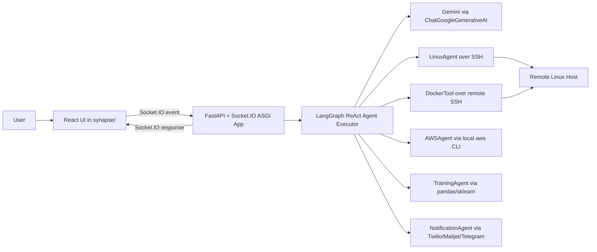

# SYNAPSE

SYNAPSE is an agentic AI orchestration system that translates natural-language operational intent into concrete actions across remote Linux hosts, Docker, AWS CLI, model training, and notification channels.

This is not only an LLM wrapper. The core value comes from combining:

1. A control plane (FastAPI + Socket.IO + LangGraph agent runtime)
2. A tool plane (domain-specific execution adapters)
3. A presentation plane (React command UI)

The LLM decides *what to do next*, while the tools actually perform privileged work in real systems.

## Why This Exists (Background Story)

Traditional automation usually forces users to switch between shell scripts, AWS CLI, Docker commands, and custom ML scripts. SYNAPSE centralizes that into one interaction model:

- user expresses intent in plain language
- agent decomposes intent into tool calls
- tools execute commands in the right substrate (remote host, local process, cloud CLI, messaging providers)
- system returns a human-readable outcome

The architecture is designed as a first-principles agentic loop, where reasoning and execution are separated:

- reasoning: done by LangGraph + LLM
- execution: done by deterministic Python tool adapters

## High-Level Architecture



## Runtime Topology

### Control Plane

- ASGI app is composed as `socketio.ASGIApp(sio, other_asgi_app=fastapi_app)`.
- FastAPI handles middleware and CORS policy (`http://localhost:5173` allowed in current setup).
- Socket.IO handles real-time command ingress and response egress.
- The orchestrator uses `create_react_agent(llm, tools)` from LangGraph prebuilt utilities.

### Tool Plane

- Linux and Docker actions execute on a remote host via SSH.
- AWS commands execute locally via `subprocess.run` calling `aws` CLI.
- Training executes locally using pandas + scikit-learn and writes `startup_model.pkl`.
- Notification calls execute locally via provider SDKs/APIs.

### Presentation Plane

- Frontend is Vite + React + TypeScript.
- UI includes entry screen, command input, chat transcript, typing animation, and scrambled-text visual output.

## End-to-End Command Lifecycle

The current backend command path is:

1. Client sends Socket.IO event `execute_natural_command` with payload:

   ```json
   { "command": "your natural language instruction" }
   ```

2. Backend handler in `main.py` receives command and invokes:

   ```python
   result = agent_executor.invoke({"messages": [("human", query)]})
   ```

3. LangGraph ReAct loop performs iterative reasoning:

   - inspect user intent
   - decide whether a tool call is needed
   - call selected tool with generated arguments
   - read tool output
   - continue loop until final natural-language answer is ready

4. Backend extracts final message content from returned `messages` and emits:

   ```json
   { "data": "final answer or error summary" }
   ```

   using Socket.IO event `command_output` to the same `sid`.

5. Frontend renders output in chat UI.

## Agent Orchestration Internals

### Tool Registry (Active)

The orchestrator registers these tools in `main.py`:

- `RunShellCommand` -> `LinuxAgent.run_command`
- `CreateRemoteFile` -> `LinuxAgent.create_file` (typed schema with `remote_path`, `content`, optional `mode`)
- `RunDockerCommand` -> `DockerTool.run_command`
- `RunAWSCommand` -> `AWSAgent.run_cli`
- `TrainStartupModel` -> `TrainingAgent.train_startup_model`
- `SendEmailNotification` -> `NotificationAgent.notify_by_email`
- `SendSMSNotification` -> `NotificationAgent.notify_by_sms`
- `SendTelegramNotification` -> `NotificationAgent.notify_by_telegram`

### Reasoning Loop Characteristics

- Agent is created once at process startup and reused.
- Each incoming command is currently treated as a one-shot turn (`messages` contains one human message for that request).
- There is no persisted multi-turn memory in the backend handler.
- Tool outputs are stringified and fed back into the reasoning loop.
- Final response returned to UI is the last message content from the agent output.

## Tool Deep Dive

### LinuxAgent (Remote Command and File Primitive)

Implementation notes:

- Uses Paramiko SSH client per call (`_get_ssh_client`).
- Credentials/host come from environment variables.
- `run_command(command)` executes exactly one shell command and returns stdout or structured error string with exit code.
- `create_file(remote_path, content, mode=None)`:
  - supports `~` expansion using remote `$HOME`
  - ensures parent directories exist through recursive SFTP mkdir logic
  - writes file content over SFTP
  - optionally applies permissions with `chmod`

Design implication:

- This module acts as the remote execution substrate for multiple higher-level tools.

### DockerTool (Docker Adapter over SSH)

Implementation notes:

- Delegates to `LinuxAgent`.
- Prefixes all commands with `docker`.
- Exposes convenience helpers (`list_containers`, `get_logs`) plus generic `run_command`.

Design implication:

- Keeps Docker execution isolated as a domain tool while reusing SSH transport.

### AWSAgent (Local Cloud CLI Adapter)

Implementation notes:

- Uses local `subprocess.run` to execute `aws` CLI.
- Parses command with `shlex.split`.
- Removes accidental duplicated leading `aws` token to harden invocation.
- Appends `--region <AWS_DEFAULT_REGION>` unless already provided.
- Returns stdout or structured stderr on non-zero exit.

Design implication:

- Cloud interactions happen on the backend host context, not via remote SSH by default.

### TrainingAgent (Embedded ML Workflow)

Implementation notes:

- Hardcoded dataset path: `~/train/50_startup.csv`.
- Hardcoded target: `Profit`.
- Preprocessing: one-hot encode `State` with `drop_first=True`.
- Split: `train_test_split(test_size=0.2, random_state=42)`.
- Model: `RandomForestRegressor(n_estimators=100, random_state=42)`.
- Output artifact: `startup_model.pkl` in backend working directory.

Design implication:

- Tool is deterministic and task-specific, suitable as a fixed capability in the agent toolbox.

### NotificationAgent (Multi-Channel Completion Hooks)

Implementation notes:

- Initializes Twilio, Mailjet, and Telegram clients at startup.
- Sends to preconfigured recipient endpoints from environment variables.
- Methods expose simple signatures and return success/error strings.

Design implication:

- Enables closed-loop workflows where task execution can trigger external alerts.

## Event Contract and UI Integration

Backend event contract currently implemented:

- Inbound: `execute_natural_command` with `{ "command": "..." }`
- Outbound: `command_output` with `{ "data": "..." }`

Frontend currently:

- emits `chat message` from `App.tsx`
- tracks connection state (`connect`/`disconnect`)
- does not yet show a backend listener in `App.tsx` for `command_output`

Integration note:

- To enable full round-trip execution, frontend event names and listeners should align with backend contract above.

## Security and Trust Boundaries

This system executes high-impact actions. Current trust boundary model:

- LLM can generate tool arguments dynamically.
- Linux/Docker tools can execute remote shell commands.
- AWS tool can execute arbitrary AWS CLI subcommands.
- Notification tools can send external communications.

Operational safeguards recommended:

1. Add allowlists/deny-lists for commands and AWS services.
2. Run backend under least-privilege IAM/user roles.
3. Isolate SSH target hosts and rotate credentials regularly.
4. Add approval gates for destructive actions.
5. Add audit logging for prompt, tool call, and output.

## Concurrency, Latency, and Reliability

Current behavior and implications:

- Socket handler is async but calls synchronous `agent_executor.invoke(...)`.
- Tool calls are mostly synchronous/blocking.
- Each SSH call opens a new connection (higher latency, simpler isolation).
- Error handling converts exceptions to user-visible text responses.
- Logging is enabled globally at DEBUG level; LinuxAgent emits command-level logs.

Possible scaling upgrades:

1. Move long-running tool invocations to worker queue.
2. Add streaming partial outputs over Socket.IO.
3. Introduce pooled SSH sessions or command gateway.
4. Persist per-session conversation memory/state.

## Environment Variables

Set these in local environment or `.env`.

### Core LLM and Backend

- `GEMINI_API_KEY`

### Remote Linux / Docker over SSH

- `SSH_HOST`
- `SSH_USERNAME`
- `SSH_PASSWORD`
- `SSH_PORT` (optional, defaults to `22`)

### AWS CLI

- `AWS_DEFAULT_REGION`

### Notification Channels

- `MY_PHONE_NUMBER`
- `MY_EMAIL`
- `TELEGRAM_CHAT_ID`
- `TWILIO_ACCOUNT_SID`
- `TWILIO_AUTH_TOKEN`
- `TWILIO_PHONE_NUMBER`
- `MAILJET_API_KEY`
- `MAILJET_SECRET_KEY`
- `MAILJET_SENDER_EMAIL`
- `TELEGRAM_BOT_TOKEN`

## Local Development

### Backend

```bash
python -m venv .venv
source .venv/Scripts/activate
pip install -r requirements.txt
python start_backend.py
```

### Frontend

```bash
cd synapse
npm install
npm run dev
```

## Extensibility Model

To add a new capability:

1. Implement a deterministic adapter class/method in Python.
2. Wrap it as a `Tool(...)` in `main.py` with clear name and description.
3. If parameters are non-trivial, define a `pydantic` schema and attach via `args_schema`.
4. Keep return values concise and machine-readable where possible.
5. Optionally add UI affordances for specialized command templates.

The key design principle is: keep tools deterministic and side-effect semantics explicit, while the agent handles planning and decomposition.

## Current Non-Active Modules

`creative_agent.py` and `devops_tool.py` exist in the repository but are not currently wired into the active tool list in `main.py`.

## Quick File Map

```text
main.py                 - orchestration entrypoint (agent + socket handlers)
start_backend.py        - uvicorn launcher
linux_agent.py          - remote SSH execution primitives
docker_agent.py         - docker-over-ssh adapter
aws_agent.py            - local aws CLI adapter
training_agent.py       - embedded ML training workflow
notification_agent.py   - SMS/email/telegram adapters
synapse/src/App.tsx     - frontend shell and socket wiring
synapse/src/socket.ts   - frontend socket connection target
```